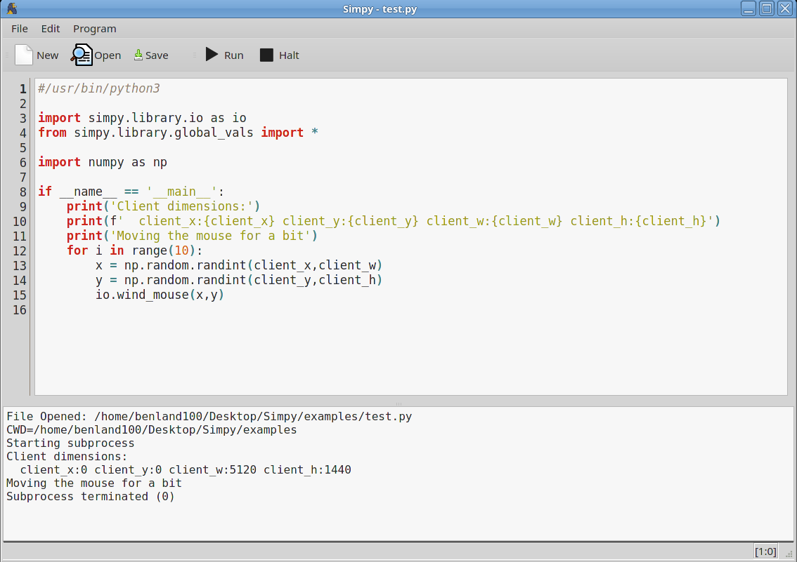
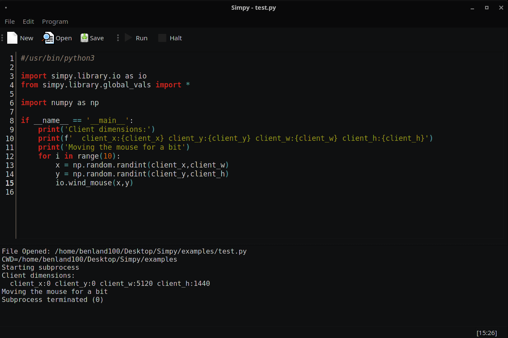

# Simpy


Simpy is a minimal clone of the popular automation utility 
[Simba](https://github.com/MerlijnWajer/Simba), writen in Python and targeting 
Python as a scripting language. 

## Installing

Some form of [Python 3.8+](https://www.python.org/downloads/) is required. You may
find it easier to install a more integrated Python environment like 
[Anaconda](https://www.anaconda.com/products/distribution) or whatever is 
provided by your system repository. In your python environment, you must know 
how to run `pip` to install python packages, and how to run python programs.

Execute the following command to install the latest version of Simpy:
```
pip install --user git+https://github.com/BenLand100/Simpy
```

This will also install all dependencies of Simpy, which do all the heavy lifting.
* [PyQt5](https://pypi.org/project/PyQt5/)
* [PyAutoGUI](https://pyautogui.readthedocs.io/en/latest/)
* [NumPy](https://numpy.org/)
* [Pillow](https://pillow.readthedocs.io/en/stable/)

## Usage

Simpy is a minimal IDE that runs Python scripts. Figuring out how to launch it 
on your platform is the most complicated step. To run the currently open program,
press `Run` on the toolbar. 

There is an internal library module `simpy.library` which contains some 
univerally useful functions for searching for objects on the scree and mouse /
keyboard control. 

Simpy _just_ executes Python code, so anything you `pip install` will be 
available to Simpy.

You can probably figure out the rest.

### Linux / OSX Specific

After installing, you can run the program `Simpy` to launch the GUI. It will 
also open a file as an argument. 

### Cross-platform (+ Windows)

After installing, you can execute the `simpy` python module, which optionally
takes a file to open as an argument.

```
python3 -m simpy
```

Indeed, with Simpy installed, you can `import simpy.[...]` in any python
program, so feel free to do development in [Juptyter](https://jupyter.org/) 
and deploy with Simpy.

## Screenshots

Simpy will adapt to your system theme.





## Developer Environment

If you want to work on Simpy, you need to be able to submit pull requests,
which are _very welcome_.

Requirements:
* Python 3.8+
* git


Instead of using pip to pull the git repo, clone this repository somewhere on
your machine.

```
git clone https://github.com/BenLand100/Simpy
```

Then install this cloned repository as a `pip` package.

```
pip install --user -e Simpy
```

This will create an editable installation that will link to the cloned git repo. 
This means the Simpy code installed on your system will always track the files 
in the git repo.

Reinstallation may still be necessary if there are new dependencies.

## Distributing

The `package.sh` and `package.bat` scripts can run [PyInstaller](https://pyinstaller.org/en/stable/)
to create a single-file or single-folder distributable version of Simpy. Must be
run on the targeted platform.

## Copying

Copyright 2021 by Benjamin J. Land (a.k.a. BenLand100). 

Released under the GPLv3 license.
